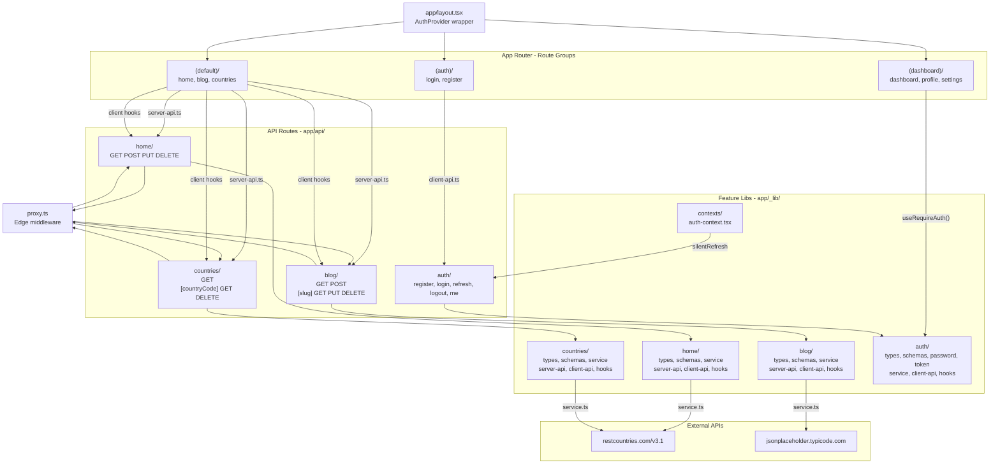

# Architecture: State Management, Data Fetching & Abstractions

## Overview

This app uses a **hybrid server-first + optimistic client** architecture built on Next.js App Router.
The core idea: fetch data on the server for the initial render, but route that fetch through the Next.js
API boundary so auth/session guards, header inspection, and runtime validation can be centralized in the
`app/api` layer. Client hooks stay thin and own only local interactivity.

The app is organised into three route groups:

- **`(default)`** -- public pages with a shared Header/Footer layout: Home, Blog, Countries
- **`(auth)`** -- centered card layout: Login, Register
- **`(dashboard)`** -- sidebar layout with an auth guard: Dashboard, Profile, Settings

A full JWT authentication system sits across the `_lib/auth/` library, the `app/api/auth/` route
handlers, the `_lib/contexts/auth-context.tsx` React context, and the `(auth)` form pages.

The next improvement area is **component streamlining**: the current layering is good, but some UI files
still do too much at once. The right direction is to keep container components small, move domain-specific
state logic into hooks, and move repeated data-shaping into shared helpers so the render tree reads like UI
instead of business logic.

---

## Folder Structure

```text
app/
  layout.tsx                         # Root layout -- wraps app in <AuthProvider>
  globals.css
  favicon.ico

  (auth)/                            # Route group -- centered card layout (no Header/Footer)
    layout.tsx
    login/
      page.tsx
      _components/
        LoginForm.tsx
    register/
      page.tsx
      _components/
        RegisterForm.tsx

  (dashboard)/                       # Route group -- sidebar layout, auth-guarded
    layout.tsx                       # Wraps children in <DashboardGuard> then <DashboardSidebar>
    _components/
      DashboardGuard.tsx             # "use client" -- redirects to /login if not authenticated
      DashboardSidebar.tsx
    dashboard/
      page.tsx
      profile/
        page.tsx
      settings/
        page.tsx

  (default)/                         # Route group -- public, shared Header/Footer layout
    layout.tsx
    page.tsx                         # / -> renders <HomePage />
    _components/
      Header.tsx                     # "use client" -- shows user name + logout when authed
      Footer.tsx
    _home/                           # Private folder for home-feature colocated files
    home/
      HomePage.tsx                   # async server component -- fetches via internal /api/home
      HomePageList.tsx               # "use client" -- optimistic list + delete
    blog/
      layout.tsx
      page.tsx                       # /blog -> renders <BlogContent />
      _components/
        BlogContent.tsx              # async server component -- fetches post list
      [slug]/
        page.tsx                     # /blog/:slug -> renders <PostContent slug={slug} />
        _components/
          PostContent.tsx            # async server component -- fetches single post
    countries/
      layout.tsx
      page.tsx                       # /countries -> renders <CountriesContent />
      _components/
        CountriesContent.tsx         # async server component -- fetches country list
      [countryCode]/
        page.tsx                     # /countries/:code -> renders <CountryDetail countryCode={code} />
        _components/
          CountryDetail.tsx          # async server component -- fetches single country
    unauthorized/
      page.tsx

  api/
    home/
      route.ts                       # GET/POST/PUT/DELETE -- guarded, Zod-validated, calls home service
    blog/
      route.ts                       # GET (list 20) / POST -- calls blog service
      [slug]/
        route.ts                     # GET / PUT / DELETE -- calls blog service
    countries/
      route.ts                       # GET (all) -- calls countries service
      [countryCode]/
        route.ts                     # GET / DELETE -- calls countries service
    auth/
      register/route.ts              # POST -- hash pw, create user, issue tokens, set refresh cookie
      login/route.ts                 # POST -- verify pw, issue tokens, set refresh cookie
      refresh/route.ts               # POST -- rotate refresh token, issue new access token
      logout/route.ts                # POST -- clear refresh cookie
      me/route.ts                    # GET -- requireAuth -> return PublicUser
    header/
      route.ts
    footer/
      route.ts

  _lib/                              # Private lib folder -- not a route
    environments.ts
    contexts/
      auth-context.tsx               # AuthProvider -- access token in memory (React state only)
    auth/
      types.ts                       # Role, User, PublicUser, AccessTokenPayload, AuthResponse, ...
      schemas.ts                     # loginSchema, registerSchema (Zod)
      password.ts                    # server-only -- hashPassword, verifyPassword (bcryptjs)
      token.ts                       # server-only -- signAccessToken, signRefreshToken, requireAuth, requireRole
      service.ts                     # server-only -- in-memory Map<id, User> demo store + seeded users
      client-api.ts                  # loginRequest, registerRequest, refreshRequest, logoutRequest
      hooks/
        use-require-auth.ts          # useRequireAuth(role?) -- redirects if not authed or wrong role
    home/
      types.ts
      schemas.ts
      service.ts                     # server-only -- calls restcountries.com
      server-api.ts                  # server-only -- calls internal /api/home, forwards cookies
      client-api.ts                  # client -- calls /api/home
      hooks/
        use-home-todos.ts
        use-home-delete.ts
    blog/
      types.ts                       # BlogPost, BlogMutationPayload, BlogApiResponse<T>
      schemas.ts                     # blogMutationPayloadSchema (Zod)
      service.ts                     # server-only -- calls jsonplaceholder.typicode.com
      server-api.ts                  # server-only -- calls internal /api/blog, forwards cookies
      client-api.ts                  # client -- calls /api/blog
      hooks/
        use-blog-posts.ts            # useBlogPosts() -- list hook with mounted guard
        use-blog-post.ts             # useBlogPost(id) -- single post hook with mounted guard
    countries/
      types.ts                       # Country, CountryDetail, CountriesApiResponse<T>
      schemas.ts                     # countryCodeSchema (Zod -- 3-char, uppercased)
      service.ts                     # server-only -- calls restcountries.com/v3.1
      server-api.ts                  # server-only -- calls internal /api/countries, forwards cookies
      client-api.ts                  # client -- calls /api/countries
      hooks/
        use-countries.ts             # useCountries() -- list hook with mounted guard
        use-country.ts               # useCountry(code) -- single country hook with mounted guard

proxy.ts                             # Edge middleware -- stamps request-id, session, auth headers
next.config.ts                       # Image remote patterns for flagcdn.com, restcountries.com, etc.
```

---

## The Full Layer Stack

### Server read path (all features follow this pattern)

```
Browser (receives fully populated HTML on first response)
    |
    v
Server Component  (async)
  e.g. app/(default)/blog/_components/BlogContent.tsx
       app/(default)/countries/_components/CountriesContent.tsx
       app/(default)/home/HomePage.tsx
    |
    |  await getBlogPostsFromApi()  /  getCountriesFromApi()  /  getHomeTodosFromApi()
    v
Internal API Client  (server-only)
  app/_lib/blog/server-api.ts
  app/_lib/countries/server-api.ts
  app/_lib/home/server-api.ts
    |
    |  fetch("/api/[feature]") -- reads host from request headers, forwards cookies
    v
Proxy  (Edge middleware)
  proxy.ts
    |
    |  stamps x-home-authenticated, x-home-session-id, x-home-request-id
    v
Route Handler
  app/api/blog/route.ts
  app/api/countries/route.ts
  app/api/home/route.ts
    |
    |  validates proxy headers + Zod payload validation
    |  calls service layer
    v
Server-only Service  ("server-only" guard)
  app/_lib/blog/service.ts         -> jsonplaceholder.typicode.com/posts
  app/_lib/countries/service.ts    -> restcountries.com/v3.1
  app/_lib/home/service.ts         -> restcountries.com/v3.1
    |
    v
External API
```

### Client mutation path (all features)

```
Browser UI
    |
    |  useBlogPosts() / useHomeDelete() / useCountries() etc.
    v
Client Hook  ("use client")
  app/_lib/blog/hooks/use-blog-posts.ts
  app/_lib/home/hooks/use-home-delete.ts
    |
    |  calls client-api helper
    v
Client API Layer
  app/_lib/blog/client-api.ts
  app/_lib/countries/client-api.ts
  app/_lib/home/client-api.ts
    |
    |  fetch("/api/[feature]", { method: POST | PUT | DELETE })
    v
Route Handler  ->  Service  ->  External API
  (same stack as server read path above)
```

### Auth path

```
Browser UI
  app/(auth)/login/_components/LoginForm.tsx
  app/(auth)/register/_components/RegisterForm.tsx
    |
    |  loginRequest() / registerRequest() from client-api
    v
app/_lib/auth/client-api.ts
    |
    |  POST /api/auth/login  or  POST /api/auth/register
    v
Route Handler
  app/api/auth/login/route.ts
  app/api/auth/register/route.ts
    |
    |  Zod validation (loginSchema / registerSchema)
    |  verifyPassword / hashPassword (bcryptjs, 12 rounds)
    |  signAccessToken + signRefreshToken (jose, HS256)
    |  Sets HTTP-only refresh cookie (path: /api/auth, SameSite=lax)
    v
Auth Service
  app/_lib/auth/service.ts   -- in-memory Map<string, User> demo store
    |
    |  Returns access token in response body (stored in React memory only)
    |  Returns refresh token only via HTTP-only cookie (never JS-accessible)
    v
AuthProvider
  app/_lib/contexts/auth-context.tsx
    |
    |  Stores access token in React state (never localStorage, never cookie)
    |  silentRefresh() on mount reads /api/auth/refresh via HTTP-only cookie
    |  getToken() deduplicates concurrent refresh calls (refreshPromiseRef)
    v
Protected routes / components
  app/(dashboard)/  ->  DashboardGuard.tsx calls useRequireAuth()
  app/(default)/_components/Header.tsx  ->  shows user + logout button
```

---

## JWT Token Strategy

| Token         | Storage                            | Lifetime | Notes                                         |
| ------------- | ---------------------------------- | -------- | --------------------------------------------- |
| Access token  | React state (memory only)          | 15 min   | Never written to cookie or localStorage       |
| Refresh token | HTTP-only cookie, `path=/api/auth` | 7 days   | Rotated on every use (refresh-token rotation) |

**Why memory for access tokens?** XSS cannot steal what is not in the DOM or localStorage. An
attacker running arbitrary JS in the page cannot read a value held only in React state.

**Why `path=/api/auth` for the refresh cookie?** The cookie is not sent on every request -- only
on requests to `/api/auth/*`. This minimises the attack surface for CSRF.

**Silent refresh**: on mount, `AuthProvider` calls `/api/auth/refresh`. If the user has a valid
refresh cookie (e.g. they navigated back to the site), a new access token is issued transparently
without a login redirect.

---

## Why It Is Fast

### 1. Server-side initial fetch (zero client waterfalls)

All page-level data components are `async` React Server Components. The user receives fully
populated HTML on the first response -- no loading spinner, no skeleton, no second round-trip.

```ts
// app/(default)/blog/_components/BlogContent.tsx
export default async function BlogContent() {
  const posts = await getBlogPostsFromApi();
  return <ul>{posts.map(...)}</ul>;
}
```

### 2. The read path favors protection over the absolute fastest hop

Server components fetch through `/api/[feature]` on purpose. That adds one internal hop, but it
guarantees every GET passes through the same guardrail stack as writes:

- Proxy headers are attached in `proxy.ts`
- Auth/session placeholders are centralized there
- Request validation and shape enforcement live in the route handler
- Service logic stays pure -- it does not know about auth, headers, or sessions

### 3. Optimistic client delete (instant perceived response)

When a user clicks Delete on the Home page, the item disappears immediately in local state
before the server confirms the operation.

```ts
const handleDelete = async (id: string) => {
  setTodosList((prev) => prev.filter((todo) => todo.cca3 !== id)); // instant
  await deletePost(id); // fires in background, rolls back on error
};
```

### 4. Proxy provides a framework-level request gate

`proxy.ts` runs before every `/api/*` request and stamps upstream headers:

- `x-home-authenticated`
- `x-home-session-id`
- `x-home-request-id`

The home route handler rejects requests that do not satisfy those headers. Real session
inspection can replace the placeholder in `proxy.ts` without touching the service layer.

### 5. `server-only` guard prevents leaking server logic to the client bundle

All `service.ts` files have `import "server-only"` at the top. Accidental import in a client
component throws a build error -- keeping credentials, internal URLs, and backend logic out of
the browser bundle.

---

## File Responsibilities

| File                                             | Env         | Responsibility                                                        |
| ------------------------------------------------ | ----------- | --------------------------------------------------------------------- |
| `app/_lib/[feature]/types.ts`                    | Both        | Shared TypeScript interfaces only. No logic.                          |
| `app/_lib/[feature]/schemas.ts`                  | Server      | Zod schemas for route handler validation.                             |
| `app/_lib/[feature]/service.ts`                  | Server only | Raw fetch to external API. `"server-only"` guard.                     |
| `app/_lib/[feature]/server-api.ts`               | Server only | Calls internal `/api/[feature]` from server components.               |
| `app/_lib/[feature]/client-api.ts`               | Client only | Calls `/api/[feature]` from the browser. Typed wrappers.              |
| `app/_lib/[feature]/hooks/use-*.ts`              | Client only | React hooks. Delegate to client-api. Own mounted-guard pattern.       |
| `app/api/[feature]/route.ts`                     | Server only | Validates proxy/auth headers + Zod payload, then calls service.       |
| `proxy.ts`                                       | Edge        | Stamps pseudo-session/auth headers and request IDs before API routes. |
| `app/_lib/auth/password.ts`                      | Server only | bcryptjs hashPassword / verifyPassword (12 rounds).                   |
| `app/_lib/auth/token.ts`                         | Server only | jose JWT sign/verify, requireAuth, requireRole, AuthError.            |
| `app/_lib/auth/service.ts`                       | Server only | In-memory demo user store (replace with DB for production).           |
| `app/_lib/auth/client-api.ts`                    | Client only | login/register/refresh/logout fetch wrappers.                         |
| `app/_lib/contexts/auth-context.tsx`             | Client only | AuthProvider -- access token in memory, silentRefresh on mount.       |
| `app/(dashboard)/_components/DashboardGuard.tsx` | Client only | Redirects to /login if not authenticated.                             |
| `app/(default)/_components/Header.tsx`           | Client only | Shows user name + role badge; logout clears token + redirects.        |

---

## Auth File Detail

### `app/_lib/auth/types.ts`

```ts
type Role = "admin" | "user";
interface User {
  id;
  email;
  passwordHash;
  role;
  createdAt;
}
interface PublicUser {
  id;
  email;
  role;
  createdAt;
} // no passwordHash
interface AccessTokenPayload {
  sub;
  email;
  role;
  type: "access";
}
interface RefreshTokenPayload {
  sub;
  email;
  role;
  type: "refresh";
}
interface AuthResponse {
  user: PublicUser;
  accessToken: string;
}
interface LoginPayload {
  email;
  password;
}
interface RegisterPayload {
  email;
  password;
  role?;
}
```

### `app/_lib/auth/schemas.ts`

- `loginSchema` -- email + password (min 1)
- `registerSchema` -- email + password (min 8, 1 uppercase, 1 number)

### Seeded demo users (auth service)

| Email             | Password | Role  |
| ----------------- | -------- | ----- |
| admin@example.com | Admin123 | admin |
| user@example.com  | User1234 | user  |

---

## Blog Feature Detail

**External API**: `https://jsonplaceholder.typicode.com/posts`

| Route                    | Handler                         | Service call           |
| ------------------------ | ------------------------------- | ---------------------- |
| `GET /api/blog`          | list 20 posts                   | `getBlogPosts()`       |
| `POST /api/blog`         | create post (Zod validated)     | `createBlogPost(data)` |
| `GET /api/blog/:slug`    | single post (slug = numeric ID) | `getBlogPost(id)`      |
| `PUT /api/blog/:slug`    | update (Zod validated)          | `updateBlogPost(data)` |
| `DELETE /api/blog/:slug` | delete                          | `deleteBlogPost(id)`   |

**UI**: Both list and detail pages are async Server Components fetching via `server-api.ts`. The
slug in the URL is a string; it is converted to `Number(slug)` before the service call.

---

## Countries Feature Detail

**External API**: `https://restcountries.com/v3.1`

| Route                         | Handler                             | Service call       |
| ----------------------------- | ----------------------------------- | ------------------ |
| `GET /api/countries`          | all countries (list fields only)    | `getCountries()`   |
| `GET /api/countries/:code`    | single country (detail fields)      | `getCountry(code)` |
| `DELETE /api/countries/:code` | placeholder delete (Zod code check) | --                 |

**Notes**:

- `/v3.1/alpha/{code}` returns an **array** -- the service extracts `[0]`.
- Country code validated as exactly 3 chars, uppercased (`countryCodeSchema`).
- `CountryDetail extends Country` adds capital, currencies, languages, coatOfArms, maps, timezones, area.
- Images rendered with `next/image` (remote pattern for `flagcdn.com`, `upload.wikimedia.org`, `restcountries.com`).

---

## Validation And Guarding Strategy

### Why validation belongs in the route

The route handler is the first stable server boundary for client traffic. It is the right place to:

- Validate request bodies with Zod
- Validate required proxy/auth headers
- Normalize error responses
- Reject malformed requests before they reach the service layer

The service assumes it is receiving already-validated input.

### Zod coverage by feature

| Schema                      | Used in                                    |
| --------------------------- | ------------------------------------------ |
| `proxyGuardHeadersSchema`   | `app/api/home/route.ts`                    |
| `homeMutationPayloadSchema` | `app/api/home/route.ts`                    |
| `homeDeletePayloadSchema`   | `app/api/home/route.ts`                    |
| `blogMutationPayloadSchema` | `app/api/blog/route.ts`, `[slug]/route.ts` |
| `countryCodeSchema`         | `app/api/countries/[countryCode]/route.ts` |
| `loginSchema`               | `app/api/auth/login/route.ts`              |
| `registerSchema`            | `app/api/auth/register/route.ts`           |

---

## Current Auth/Session Model

The app now has a real JWT auth system. `proxy.ts` still attaches `x-home-authenticated`,
`x-home-session-id`, and `x-home-request-id` as a platform-level guard for the home API.
The auth routes operate independently -- they use `requireAuth(request)` from `token.ts`
which reads the `Authorization: Bearer <token>` header.

For production, replace `app/_lib/auth/service.ts` (in-memory Map) with a real database
adapter. The token, password, schema, and route layers all stay the same.

---

## Folder Diagram



---

## How To Add Another Feature

Follow the exact same six-file pattern used by `home/`, `blog/`, and `countries/`:

1. **`_lib/[feature]/types.ts`** -- TypeScript interfaces + `[Feature]ApiResponse<T>`
2. **`_lib/[feature]/schemas.ts`** -- Zod schemas for route handler validation
3. **`_lib/[feature]/service.ts`** -- `"server-only"`, calls external API directly
4. **`_lib/[feature]/server-api.ts`** -- `"server-only"`, calls internal `/api/[feature]`, forwards cookies + base URL from headers
5. **`_lib/[feature]/client-api.ts`** -- browser-side fetch wrapper calling `/api/[feature]`
6. **`_lib/[feature]/hooks/use-[feature].ts`** -- `"use client"`, `useEffect` with mounted guard

Then:

- Add `app/api/[feature]/route.ts` -- Zod validation + service calls
- Add `app/(default)/[feature]/page.tsx` -- passes params to a server component
- Add `app/(default)/[feature]/_components/[Feature]Content.tsx` -- async server component using `server-api.ts`

---

## Patterns Summary

| Goal                        | Pattern                                                                                          |
| --------------------------- | ------------------------------------------------------------------------------------------------ |
| Initial page data, guarded  | `async` server component -> `server-api.ts` -> internal `/api/` -> proxy -> route -> service     |
| Fastest server-side read    | Direct service call (skip internal API hop -- only if no auth/header validation needed)          |
| Client interactivity        | Client hook -> `client-api.ts` -> `/api/[feature]` -> service                                    |
| Auth-protected routes       | `useRequireAuth(role?)` in `DashboardGuard` or page-level guard components                       |
| Instant UI on mutation      | Optimistic local state update before awaiting the network, rollback on error                     |
| No backend logic in browser | `"server-only"` + service layer                                                                  |
| Token security              | Access token in React memory only; refresh token in HTTP-only cookie scoped to `/api/auth`       |
| Central auth/session checks | `proxy.ts` stamps headers; route validates; `requireAuth()` / `requireRole()` for protected APIs |
| Clean components            | Hooks own behavior, server components own data, client components own interaction state          |
| Easy to test                | Each layer is a plain function -- hooks, service, api wrappers are all unit-testable             |

---

## When to Use What

```
Need data on first render with strict API enforcement?
  -> fetch in async server component via internal /api/...

Need the absolute fastest server-side read and you trust the caller?
  -> call the service directly from the server component

Need to react to user interaction (mutations, client state)?
  -> handle in a client hook that delegates to client-api.ts

Is a component doing data shaping and rendering at the same time?
  -> move shaping into a presenter or view-model helper

Need auth in a route handler?
  -> import requireAuth / requireRole from _lib/auth/token.ts

Need to guard a whole route group?
  -> add a DashboardGuard-style client component in the group's layout

Do multiple features repeat fetch / route / error plumbing?
  -> centralize shared request and route helpers in _lib/utils/

Need optimistic feedback?
  -> update local state first, then call hook, rollback on error

Need to share auth state across multiple components?
  -> useAuth() from auth-context -- access token is already global
```
